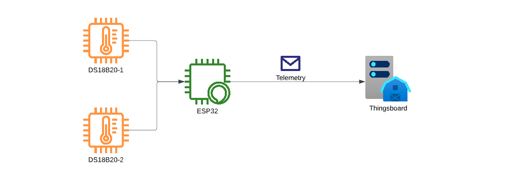
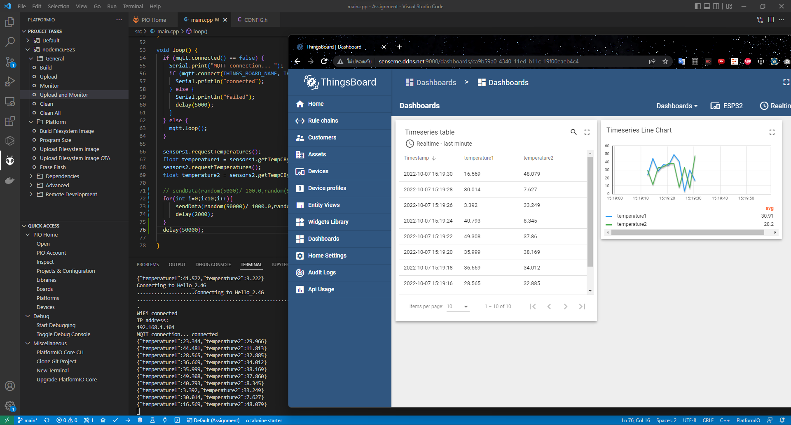

# CJ IoT Assignment

This Assignment want you connect a device to `Thingsboard` [IoT Platform] through MQTT, The device can send a telemetry `temperature1`, `temperature2` to platform by using an `AccessToken` that generate from Thingsboard.

In the Thingsboard platform, Your device should present a telemetry on Dashboard [Thingsboard has a Dashboard service inside.]

## Prerequisite

- ESP32 x 1
- DS18B20 x 2
- Thingsboard
  - URL: http://senseme.ddns.net:9000/login
  - MQTT Port: 1883



## Features

- Read a temperature from 2xDS18B20.
- Device can read a temperature individual channel.
- Device can send a telemetry through MQTT.

## Telemetry Format

```
{
    "temperature1": number,
    "temperature2": number
}
```

## Configuration

First, Change a config file in `/include/CONFIG.h`

```c++
// WiFi
#define WIFI_SSID "SSID"
#define WIFI_PASSWORD "psk1234"

// Thingsboard platform
#define THINGS_BOARD_HOSTNAME "xxxxxxx"
#define THINGS_BOARD_TOKEN "xxxxxx"

// DS18B20
#define DS18B20_1 16 // For DS18B20 Channel 1.
#define DS18B20_2 17 // For DS18B20 Channel 2.
```

## Deliverable

- Source code on Git repository.

## Documentation

- [Visual Studio Code](https://code.visualstudio.com/)
- [PlatformIO](https://platformio.org/)
- [Thingsboard](https://thingsboard.io/docs/)
- [ESP32](https://www.espressif.com/en/products/socs/esp32)
- [DS18B20](https://datasheets.maximintegrated.com/en/ds/DS18B20.pdf)

## 🚀 Notes

- Try your best. If you cannot cover all tasks above, you can send your deliverable source code to us.
- You can enhance your idea to improve application. Maybe it can increase your points.


## Unit test




- unit test send data 10 times
{"temperature1":23.344,"temperature2":29.966}✅
{"temperature1":44.481,"temperature2":11.813}✅
{"temperature1":28.565,"temperature2":32.885}✅
{"temperature1":36.669,"temperature2":34.012}✅
{"temperature1":35.999,"temperature2":38.169}✅
{"temperature1":49.308,"temperature2":37.860}✅
{"temperature1":40.793,"temperature2":8.345}✅
{"temperature1":3.392,"temperature2":33.249}✅
{"temperature1":30.014,"temperature2":7.627}✅
{"temperature1":16.569,"temperature2":48.079}✅

ThingsBoard can reciver data and show Chart on Dashboards✅
